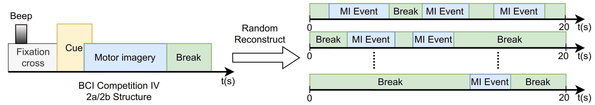

# ConSegAP: Consistency-Guided Feature Synergy with Adaptive Patch Partitioning for Online EEG Event Segmentation

This repository is the official implementation of ConSegAp.


ConSegAP, a groundbreaking end-to-end framework for online EEG event segmentation, addressing the scarcity of real-time segmentation research in motor imagery BCIs, where classification-oriented approaches predominate. ConSegAP dynamically segments EEG signals to handle variable event durations, captures long-range dependencies with linear-time complexity, and ensures temporal coherence through a specialized loss. This design enhances boundary precision and classification performance while achieving sub-10ms latency, making it ideal for real-time motor imagery BCIs.

## Requirements

To set up the environment, create a Conda environment and install dependencies:

```bash
conda create -n consegap python=3.9.12
conda activate consegap
pip install -r requirements.txt
```

The `requirements.txt` includes:
- `torch==2.0.1`
- `torchaudio==2.0.2`
- `numpy==1.23.5`
- `scipy==1.10.1`
- `mne==1.4.0`

To generate `requirements.txt`, activate your environment and run:
```bash
pip freeze > requirements.txt
```
Edit to keep only essential packages (e.g., `torch`, `mne`), as described in `docs/setup.md`.

## Datasets
1. Download BCI Competition IV-2a/2b datasets from [BCI Competition IV]((https://www.bbci.de/competition/iv/#dataset2a)).

3. Preprocess data (bandpass filter 8–30 Hz, artifact removal) using `preprocess/preprocess_bci.py`.
4. Place preprocessed `.mat` files in `data/`:
```
data/
  bci_iv_2a/
    sub01/
      train.mat
      test.mat
    ...
  bci_iv_2b/
    ...
```

Run preprocessing:
```bash
python preprocess/preprocess_bci.py --data-dir data/raw --output-dir data/bci_iv_2a
```

## Training

To train ConSegAP on BCI IV-2a for a specific subject (e.g., sub01), run:

```bash
python train_model.py --data-dir data/bci_iv_2a --subject sub01 --num-epochs 10 --batch-size 32 --num-patches 100 --emb-size 64 --class-weights 0.4,1.0,1.0 --focal-gamma 2.0 --loss-weights 1.5,0.5,0.1
```

**Training Procedure**:
- **Dataset**: BCI IV-2a/2b, training/test sessions per subject (9 subjects each).
- **Hyperparameters**: `num_patches=100`, `emb_size=64`, `num_epochs=10`, `batch_size=32`, `class_weights=[0.4, 1.0, 1.0]`, `focal_gamma=2.0`, `loss_weights=[1.5, 0.5, 0.1]`.
- **Optimizer**: Adam (learning rate $10^{-3}$, $\beta_1=0.9$, $\beta_2=0.999$).
- **Hardware**: NVIDIA RTX 4090 GPU, CUDA 12.1, ~2 hours per subject (~18 hours for 9 subjects).
- **Output**: Models saved in `models/` (e.g., `consegap_bci_2a_sub01.pth`).

Run `python train_model.py --help` for options (e.g., `--dataset bci_iv_2b`).

## Evaluation

To evaluate the trained ConSegAP model on BCI IV-2a for a subject, run:

```bash
python eval_model.py --model-file models/consegap_bci_2a_sub01.pth --data-dir data/bci_iv_2a --subject sub01 --batch-size 32
```

For aggregate metrics across all subjects:

```bash
python eval_model.py --data-dir data/bci_iv_2a --batch-size 32 --all-subjects
```

This computes Precision, Recall, F1, Grid Accuracy, Event Accuracy, and Event-level IoU, matching the paper’s results.

## Pre-trained Models

Download pre-trained models:
- [ConSegAP for BCI IV-2a](https://drive.google.com/file/d/anonymous_consegap_bci_2a.pth): Trained on BCI IV-2a, 9 subjects, `num_patches=100`, `emb_size=64`, `num_epochs=10`.
- [ConSegAP for BCI IV-2b](https://drive.google.com/file/d/anonymous_consegap_bci_2b.pth): Trained on BCI IV-2b.

See `models/README.md` for training details.

## Results

ConSegAP outperforms baselines on the BCI IV-2a dataset:

### [EEG Event Segmentation on BCI IV-2a](https://paperswithcode.com/dataset/bci-competition-iv-2a)

| Method        | Avg F1 Score | Avg Event-level IoU | Model Link |
|---------------|--------------|---------------------|------------|
| ConSegAP      | 0.709        | 0.8990              | [Link](https://drive.google.com/file/d/anonymous_consegap_bci_2a.pth) |
| Conformer     | 0.543        | 0.8389              | -          |
| CTNet         | 0.668        | 0.8941              | -          |
| DeepConvNet   | 0.520        | 0.6096              | -          |
| EEGNet        | 0.518        | 0.5033              | -          |

**Reproduce Results**:
- Run evaluation commands to compute per-subject metrics.
- Generate plots with:
```bash
python plot_results.py --results-dir results/bci_2a --output figures/per_subject_performance.png
```
BCI IV-2b results are in `results/bci_2b/`.

## Contributing

This project is licensed under the MIT License (see `LICENSE`). To contribute:
1. Fork the repository.
2. Create a feature branch (`git checkout -b feature/your-feature`).
3. Commit changes (`git commit -m 'Add your feature'`).
4. Push to the branch (`git push origin feature/your-feature`).
5. Open a pull request.

Follow PEP 8 style guidelines and include unit tests in `tests/`. Report issues or feature requests on the GitHub Issues page.
