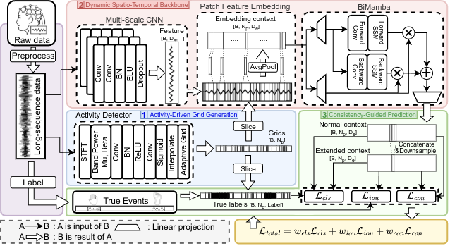
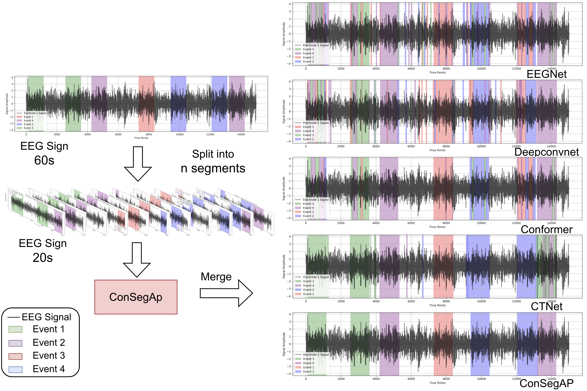

# ConSegAP: Consistency-Guided Feature Synergy with Adaptive Patch Partitioning for Online EEG Event Segmentation

This repository is the official implementation of ConSegAp.



ConSegAP, a groundbreaking end-to-end framework for online EEG event segmentation, addressing the scarcity of real-time segmentation research in motor imagery BCIs, where classification-oriented approaches predominate. ConSegAP dynamically segments EEG signals to handle variable event durations, captures long-range dependencies with linear-time complexity, and ensures temporal coherence through a specialized loss. This design enhances boundary precision and classification performance while achieving sub-10ms latency, making it ideal for real-time motor imagery BCIs.

## Requirements

To set up the environment, create a Conda environment and install dependencies:

```bash
conda create -n consegap python=3.9.12
conda activate consegap
pip install -r requirements.txt
```

To generate `requirements.txt`, activate your environment and run:
```bash
pip freeze > requirements.txt
```
Edit to keep only essential packages (e.g., `torch`, `mne`), as described in `docs/setup.md`.

## Dataset Setup

1. **Download Datasets**:
   Download BCI Competition IV-2a and IV-2b [datasets](https://www.bbci.de/competition/iv/#dataset2a) and [true Labels](https://www.bbci.de/competition/iv/results/index.html) from BCI Competition IV website. Unzip the files into `data/raw/`:
   ```
   data/raw/
     BCICIV_2a_gdf/
       A01T.gdf
       A01E.gdf
       ...
     BCICIV_2a_labels/
       A01T.mat
       A01E.mat
       ...
     BCICIV_2b_gdf/
       B0101T.gdf
       B0102T.gdf
       ...
   ```
   - **BCI IV-2a**: Contains MATLAB `.mat` files per subject (A01–A09), with training (`A0xT.mat`) and test (`A0xE.mat`) files. Each file includes EEG signals (22 channels, 250 Hz), event labels, and metadata (channel names, sampling rate).
   - **BCI IV-2b**: Contains GDF files per subject (B01–B09), with multiple session files (e.g., `B0x0yT.gdf` for training). Each file includes EEG signals (3 channels, 250 Hz), event cues, and metadata.

2. **Preprocess Data**:
   Process datasets to crop event segments (motor imagery trials, ~4s) and break time segments (inter-trial rest periods, ~2–3s), applying bandpass filtering (4-40 Hz) and standardization. Use dataset-specific scripts:
   - For BCI IV-2a:
     ```bash
     python preprocess/preprocess_iv_2a.py  //Need to modify file path
     ```
   - In addition, we also provide a Matlab version of the code for you to use：
      ```
       preprocess/preprocess_iv_2a.m //Need to modify file path
      ```
   - For BCI IV-2b:
     ```bash
     python preprocess/preprocess_iv_2b.py //Need to modify file path
     ```
   The scripts output preprocessed `.mat` files in:
   ```
   data/
     bci_iv_2a/
        standard_2a_data/
          A01T.mat
          A01E.mat
          ...
         break_time_2a_data/
          A01E_break_preprocessed.mat
          A01T_break_preprocessed.mat
          ...
     bci_iv_2b/
        standard_and_break_time_data/
          B01E.mat
          B01T.mat
          ...
If you want to skip this step, you can find the processed data [here](https://drive.google.com/drive/folders/1HnIWjzlpS-5Md0kQqa-HtD0MNO5JZlEo?usp=sharing).
## Training

To train ConSegAP on BCI IV-2a for a specific subject (e.g., sub01), run:

```bash
python train_model.py --data 2a --data-dir ./data/4_2a_data/standard_2a_data --model ours --subject 1 --num-epochs 150 --batch-size 16
```
To train ConSegAP on BCI IV-2b for a specific subject (e.g., sub01), run:

```bash
python train_model.py --data 2b --data-dir ./data/4_2b_data/standard_and_break_time_data --model ours --subject 1 --num-epochs 150 --batch-size 16
```

**Training Procedure**:
- **Dataset**: BCI IV-2a/2b, training/test sessions per subject (9 subjects each).
- **Hyperparameters**: `num_epochs=10`, `batch_size=32`.
- **Optimizer**: Adam (learning rate $10^{-3}$, $\beta_1=0.9$, $\beta_2=0.999$).
- **Hardware**: NVIDIA RTX 4090 GPU, CUDA 12.1, ~2 hours per subject (~18 hours for 9 subjects).
- **Output**: Models saved in `ConSegAP/` (e.g., `best_model_1.pth`, `final_model_1.pth`).

Run `python train_model.py --help` for options.

## Evaluation
We have provided some [weights](https://drive.google.com/drive/folders/1HnIWjzlpS-5Md0kQqa-HtD0MNO5JZlEo?usp=sharing) for you to quickly reproduce our results.
To evaluate the trained ConSegAP model on BCI IV-2a for a subject (e.g., sub01), run:

```bash
python evaluate_model.py --data 2a --data-dir ./data/4_2a_data/standard_2a_data --model ours --subject 1 --batch-size 16 --model-path ./best_model_1.pth
```
To evaluate the trained ConSegAP model on BCI IV-2b for a subject (e.g., sub01), run:

```bash
python evaluate_model.py --data 2b --data-dir ./data/4_2b_data/standard_and_break_time_data --model ours --subject 1 --batch-size 16 --model-path ./best_model_1.pth
```

This computes Grid Accuracy, Event Accuracy, Event-level IoU, and some other important target, matching the paper’s results.
```
--- Model Parameters for Subject 1 ---
  Total Parameters: 195,950
  Total Parameters (in millions): 0.20 M
================================================
Evaluating ours model for subject 1...

--- Overall Event Metrics ---
  Grid Accuracy: 92.76%
  IoU (Class-Agnostic): 0.9123
  Event Accuracy: 83.22%
================================================

--- Inference Performance ---
  Total samples processed: 144
  Average inference time per sample: 0.010 s
  Total inference time: 1.510 seconds
================================================
```

## Results

ConSegAP outperforms baseline methods on the BCI Competition IV-2a and IV-2b datasets for EEG event segmentation, achieving superior performance across multiple metrics. The table below reports mean ± standard deviation values over the test set for each dataset, with the best results in **bold**.

### EEG Event Segmentation on BCI IV-2a and IV-2b

| Method        | Precision ↑ | Recall ↑ | F1 ↑ | Grid Acc. (%) ↑ | Event Acc. (%) ↑ | Event IoU ↑ |
|---------------|-------------|----------|------|-----------------|------------------|-------------|
|||| **BCI IV-2a** ||||
| EEGNet        | 0.54 ± 0.07 | 0.53 ± 0.07 | 0.52 ± 0.08 | 75.8 ± 3.7 | 51.3 ± 10.9 | 0.50 ± 0.31 |
| DeepConvNet   | 0.54 ± 0.07 | 0.53 ± 0.07 | 0.52 ± 0.07 | 76.5 ± 3.8 | 54.7 ± 12.7 | 0.59 ± 0.17 |
| Conformer     | 0.61 ± 0.13 | 0.55 ± 0.12 | 0.54 ± 0.14 | _85.1 ± 7.2_ | 57.9 ± 20.5 | 0.83 ± 0.07 |
| CTNet         | _0.69 ± 0.15_ | _0.69 ± 0.16_ | _0.66 ± 0.17_ | 83.8 ± 7.3 | _64.9 ± 17.2_ | _0.89 ± 0.03_ |
| **ConSegAP**  | **0.74 ± 0.14** | **0.72 ± 0.14** | **0.71 ± 0.15** | **85.5 ± 7.8** | **71.1 ± 17.0** | **0.90 ± 0.02** |
|||| **BCI IV-2b** ||||
| EEGNet        | 0.55 ± 0.06 | 0.50 ± 0.11 | 0.45 ± 0.08 | 54.1 ± 15.7 | 62.4 ± 10.5 | 0.52 ± 0.18 |
| DeepConvNet   | 0.51 ± 0.08 | 0.51 ± 0.07 | 0.46 ± 0.08 | 54.1 ± 13.8 | 68.9 ± 12.1 | 0.31 ± 0.10 |
| Conformer     | 0.58 ± 0.09 | 0.58 ± 0.09 | 0.54 ± 0.09 | 59.6 ± 11.0 | 66.5 ± 10.8 | 0.57 ± 0.15 |
| CTNet         | _0.83 ± 0.09_ | _0.82 ± 0.09_ | _0.82 ± 0.10_ | _89.6 ± 5.7_ | _73.3 ± 17.1_ | _0.81 ± 0.19_ |
| **ConSegAP**  | **0.88 ± 0.08** | **0.88 ± 0.08** | **0.88 ± 0.08** | **92.2 ± 5.1** | **85.2 ± 9.9** | **0.85 ± 0.03** |

## Online Experiment

This part describes how to reproduce ConSegAP’s online EEG segmentation experiment on a 60-second reconstructed EEG sequence from the BCI IV-2a dataset (15,000 timesteps, 250 Hz), embedding 3–9 motor imagery events. The experiment uses a sliding window of 5000 timesteps (20 seconds) with a step size of 3, simulating real-time EEG streaming. Included pre-trained weights and preprocessed data allow rapid replication of the paper’s results, with ConSegAP achieving ~10 ms latency and high event boundary accuracy.

### Dataset Processing

This part requires using the data that has been processed in the 'Dataset Setup' part before, and then running the following code to generate a 60 second sequence:
```bash
python preprocess/online-sequence.py
```
This code will generate 'test_data.h5' (defualt for sub01, you can change it in online-sequence.py). To use this data directly, ensure it’s in:

```
data/
  Online_exp_data/
    test_data.h5  # Preprocessed 60-second sequence
```

### Running the Experiment and Visualizing Results

Use the trained weights, or you can directly use the weights and preprocessed data we provide for online segmentation experiments:

```bash
python evaluate_online.py --data-file ./data/Online_exp_data/test_data.h5 --model ours --model-path best_model_1.pth --sample-idx 1 --batch-size 32 --stride 2 --segment-length 5000 --output-dir plots
```

This command processes the 60-second sequence with a 20-second sliding window (5000 timesteps), advancing by 2 timesteps, and aggregates predictions via majority voting, reproducing the paper’s real-time results.The visualization results can be found in (`plots/global_events_sample.png`)



This plot visualizes ConSegAP’s predicted event boundaries against ground truth and other backbones, demonstrating superior fidelity. 

## Contributing

This project is licensed under the MIT License (see `LICENSE`). To contribute:
1. Fork the repository.
2. Create a feature branch (`git checkout -b feature/your-feature`).
3. Commit changes (`git commit -m 'Add your feature'`).
4. Push to the branch (`git push origin feature/your-feature`).
5. Open a pull request.

Follow PEP 8 style guidelines and include unit tests in `tests/`. Report issues or feature requests on the GitHub Issues page.
